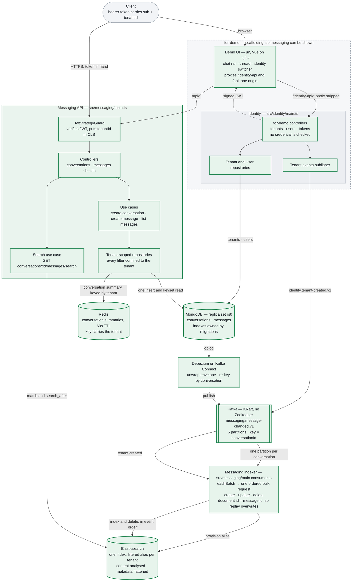

# Messaging API

RESTful message management built with NestJS, MongoDB, Kafka and Elasticsearch.

A message is written once, to MongoDB. Debezium carries the change to Kafka, a
consumer projects it into Elasticsearch, and search reads it back — scoped to a
tenant by the repository rather than by its callers, at every step.

Status: [PROGRESS.md](PROGRESS.md) · wiring: [architecture](docs/architecture.md) ·
decisions: [ADRs](docs/adr/) · log: [PLAN](docs/PLAN.md) · what is missing on purpose:
[below](#9-what-is-deliberately-not-here).

## 1. Prerequisites

**Docker, running.** With ~5 GB of disk and 4 GB of memory available to it.

## 2. Run it

```bash
./scripts/start.sh   # ~5 min the first time (2 GB of Docker images), ~70s after
```

Open **http://localhost:8088**, use the switcher in the top right to make a tenant
and two people, and start a chat.

|                  |                                                                  |
| ---------------- | ---------------------------------------------------------------- |
| Demo UI          | http://localhost:8088                                            |
| Messaging API    | http://localhost:3000 · [Swagger](http://localhost:3000/swagger) |
| Identity API     | http://localhost:3001                                            |
| Elasticsearch UI | http://localhost:8089 — indices, documents, raw queries          |
| MongoDB          | `mongodb://localhost:27018/messaging?directConnection=true`      |
| Elasticsearch    | http://localhost:9200                                            |
| Kafka            | `localhost:9094` · Connect on http://localhost:8083              |

`scripts/start.sh` brings up infrastructure, applies the migrations, creates the search
index, the Kafka topics and the CDC connector, then starts the four app containers —
in that order, waiting on health checks. Every step is idempotent, so re-running it
is also how you recover from a half-finished start. Stop it with
`docker compose --profile app down`, which keeps the data.

## 3. Working on it

Only this part needs Node 22+ and pnpm 11+ (`corepack enable pnpm`).

```bash
pnpm install
pnpm start:dev         # API, watch mode        pnpm test       # unit + integration
pnpm start:consumer    # indexer                pnpm lint
pnpm start:identity    # identity               pnpm typecheck
pnpm ui:dev            # client on :5173        pnpm ui:e2e     # Playwright + screenshots
```

## 4. Architecture

| | Meaning |
|---|---|
| green | Built and verified on a running stack |
| grey, dashed box | **`for-demo`** — scaffolding, so the service can be shown to somebody. It would not ship in this form |



The detail behind every box — what each component does, what state it is in, the
known gaps, and the reasoning for the parts that are not obvious — is in
**[docs/architecture.md](docs/architecture.md)**.

## 5. Testing

```bash
pnpm test          # unit + integration, against a real MongoDB and Elasticsearch
pnpm test:cov
pnpm lint
pnpm exec tsc --noEmit -p tsconfig.json
```

Integration tests start one MongoDB container and one Elasticsearch container for
the whole run, concurrently — Elasticsearch is a JVM and costs far more to start, so
the run pays the slower of the two rather than the sum. Each test file gets its own
database inside the MongoDB container, so files stay isolated and can run in
parallel. Elasticsearch specs share the one index and empty it between tests.

No local MongoDB or Elasticsearch is required — Docker is. The Elasticsearch specs
apply the same mapping file `pnpm es:apply-templates` uses, so a mapping mistake
fails the suite rather than surviving to production.

## 6. Testing utilities

Three harnesses behind two entry points, chosen by what you pass to [TestHelper](src/shared/test/test-helper.ts):

```ts
// Use case or repository — scans the dependency tree, exposes only what is needed
const testHelper = TestHelper.lightweightMode(MyUseCase);

// Controller — minimal Nest app with the real guard chain, filter and interceptor
const testHelper = TestHelper.lightweightMode(MyController).imports(SomeModule);

// Whole AppModule — catches wiring mistakes the lightweight modes cannot see
const testHelper = TestHelper.fullAppMode();
```

The scanner reads constructor metadata and therefore only sees class tokens. That
is why repositories take the mongoose `Connection` rather than `@InjectModel(...)`,
which resolves through a string token the scanner cannot follow.

## 7. Scripts

| Command                            | Purpose                                                                              |
| ---------------------------------- | ------------------------------------------------------------------------------------ |
| `./scripts/start.sh`               | Everything, in order, waiting on health checks. Needs only Docker. Idempotent        |
| `pnpm stack:up`                    | The same thing, for hands that are already typing `pnpm`                             |
| `pnpm build`                       | Compile with `tsc` (not the Nest CLI — see D26 in the plan)                          |
| `pnpm start:dev`                   | HTTP API with watch mode                                                             |
| `pnpm start:consumer`              | Kafka → Elasticsearch indexer                                                        |
| `pnpm migrate:up` / `migrate:down` | Apply / roll back MongoDB migrations                                                 |
| `pnpm kafka:create-topics`         | Create the topics with the right partition count (idempotent)                        |
| `pnpm es:apply-templates`          | Apply the Elasticsearch mapping and create the index (idempotent)                    |
| `pnpm migrate:create <name>`       | Scaffold a migration                                                                 |
| `pnpm debezium:register`           | Install or update the CDC connector (idempotent)                                     |
| `pnpm debezium:status`             | Connector and task state                                                             |
| `pnpm test`                        | Unit and integration tests                                                           |
| `pnpm typecheck`                   | Typecheck the app and the scripts                                                    |
| `pnpm lint`                        | ESLint with `--fix`                                                                  |
| `pnpm ui:install`                  | Install the demo UI, which has its own lockfile                                      |
| `pnpm ui:dev`                      | Vite dev server for the demo UI, proxying to both APIs                               |
| `pnpm ui:build`                    | Build the demo UI into `ui/dist`, where identity serves it                           |
| `pnpm ui:test`                     | The demo UI's unit tests                                                             |
| `pnpm ui:e2e`                      | Playwright against the running `demo-ui` container, writing screenshots              |
| `pnpm ui:review`                   | Builds [docs/ui-review/index.html](docs/ui-review/index.html) from those screenshots |

## 8. Documentation

Roughly in the order a newcomer needs them.

|                                                            |                                                                                                                  |
| ---------------------------------------------------------- | ---------------------------------------------------------------------------------------------------------------- |
| [PROGRESS.md](PROGRESS.md)                                 | What is done, what is next, and the check that settled each one                                                  |
| [CONTEXT-MAP.md](CONTEXT-MAP.md)                           | The two bounded contexts, how they relate, and a glossary for each                                               |
| [docs/architecture.md](docs/architecture.md)               | Component map: what is built, what is not, and the known gaps                                                    |
| [docs/adr/](docs/adr/)                                     | Nine decision records, each with the trade-off it accepted                                                      |
| [docs/PLAN.md](docs/PLAN.md)                               | The running log — every decision D1–D38, the milestones, what was verified on a running stack                    |
| [docs/back-of-envelope.md](docs/back-of-envelope.md)       | The capacity estimate behind the Kafka partitioning trade-off                                                    |
| [docs/testing-conventions.md](docs/testing-conventions.md) | The when/should naming pattern, what is tested at which layer, and how load-bearing tests are proven non-vacuous |

If you read only one after this file, read [CONTEXT-MAP.md](CONTEXT-MAP.md). If you read
only one decision record, read
[ADR-002](docs/adr/002-cdc-not-outbox.md) — change data capture instead of a
transactional outbox is the choice the rest of the system hangs off.

## 9. What is deliberately not here

Stated because their absence is a decision, not an oversight.

- **No endpoint lists conversations.** They can be created and posted into, not
  enumerated — which is why there is no `lastMessageAt` on the model: it would have
  been maintained for no reader.
- **No tenant provisioning.** A tenant exists because a verified token says so. Per-tenant
  Elasticsearch aliases are consequently created on first write, which is the wrong
  place for them; [PLAN.md §10](docs/PLAN.md) records why and what it would take to move them.
- **No `lastMessageAt`, no unread counts, no read receipts, no attachments.**

---

## 10. Endpoints

### Messaging — `localhost:3000`

| Method | Path                                                       | Notes                                                          |
| ------ | ---------------------------------------------------------- | -------------------------------------------------------------- |
| `POST` | `/api/v1/conversations`                                    | Creator is added to the participants automatically             |
| `GET`  | `/api/v1/conversations`                                    | The caller's own conversations, newest first, cursor paginated |
| `POST` | `/api/v1/messages`                                         | Sender comes from the token; timestamp from the server         |
| `GET`  | `/api/v1/conversations/:conversationId/messages`           | Cursor paginated, newest first                                 |
| `GET`  | `/api/v1/conversations/:conversationId/messages/search?q=` | Full-text, cursor paginated, scored, and forgiving of typos    |
| `GET`  | `/api/health`                                              | Public                                                         |

### Identity — `localhost:3001`

Seeding for a local demonstration. `for-demo` is in the path because these
endpoints hand out a token to whoever names a user, without checking anything —
and `ForDemoOnlyGuard` refuses all of them outside a local environment.

| Method | Path                               | Notes                                                                              |
| ------ | ---------------------------------- | ---------------------------------------------------------------------------------- |
| `POST` | `/api/v1/for-demo/tenants`         | Creates a tenant, and publishes the event that provisions its search alias         |
| `GET`  | `/api/v1/for-demo/tenants`         | Every tenant — the only route that enumerates them, and the first the picker calls |
| `POST` | `/api/v1/for-demo/users`           | Creates a user inside one                                                          |
| `GET`  | `/api/v1/for-demo/users?tenantId=` | Lists a tenant's users — what the picker UI will read                              |
| `POST` | `/api/v1/for-demo/tokens`          | Issues a token for a user id. No credential is checked                             |
| `GET`  | `/api/health`                      | Public                                                                             |

Another tenant's conversation answers **404**, never 403 — a 403 would confirm it
exists. A conversation in your own tenant that you are not a participant of answers
**403**, on reading and on writing alike.

That last clause used to be true only of writing. Reading checked the tenant and
stopped there, so any token for a tenant could read any conversation in it by id —
found by pointing a browser at the Isolation panel of the demo UI, fixed in both read
paths, and now covered by three tests that a mutation each kills.

---

## 11. The demo UI

A Vue 3 client in [ui/](ui/), shaped like a messenger: chats on the left, the
conversation on the right, and an identity switcher in the top right. Switching
between two people is the most repeated action in a multi-tenant demo, so it is one
click rather than a page of its own.

**What it looks like, and what was checked:**
[docs/ui-review/index.html](docs/ui-review/index.html) — screenshots taken by a real
browser driving the container, split into
[the messenger](docs/ui-review/messenger.html) and
[what the API refuses](docs/ui-review/refusals.html). Each is taken at a point a test
had just asserted something about, including the states nobody clicks through by
hand.

`./scripts/start.sh` serves it from nginx at **:8088**. While changing it, `pnpm ui:dev`
runs Vite on :5173 instead; both proxy `/identity-api` to 3001 and `/api` to 3000, so
the browser makes same-origin calls and neither service needs a CORS policy (PLAN
§10b). The two proxy configs have to be changed together.

It builds from [ui/Dockerfile](ui/Dockerfile), with `ui/` as its whole build context
— the client shares no stage with the server's image. `pnpm ui:build` is for working
locally, not a prerequisite. Port **8088** rather than 8080, which is contested enough that a page
from another project answering instead is a real possibility.

Identity served the UI first, and that was wrong in a way worth recording: the client
asks for `/identity-api/...`, identity has no such prefix and nothing to strip one
with, so the page loaded and every call it made came back as `index.html` under a 200. Serving static files and proxying an API are one job, and nginx does both.

`ui/` is a separate package on purpose: it is outside the pnpm workspace, has its
own lockfile and tsconfig, and is excluded from the server's TypeScript projects.
A Vue toolchain and a NestJS one disagree about `module`, `lib` and `types`, and
sharing one config makes both worse.

The proxy is deliberately the only thing in front of the APIs. It is not a gateway:
no authentication, no rate limiting, no request shaping — it routes two prefixes so
the browser stays on one origin. See PLAN §10b for when a real one would earn its
keep.
