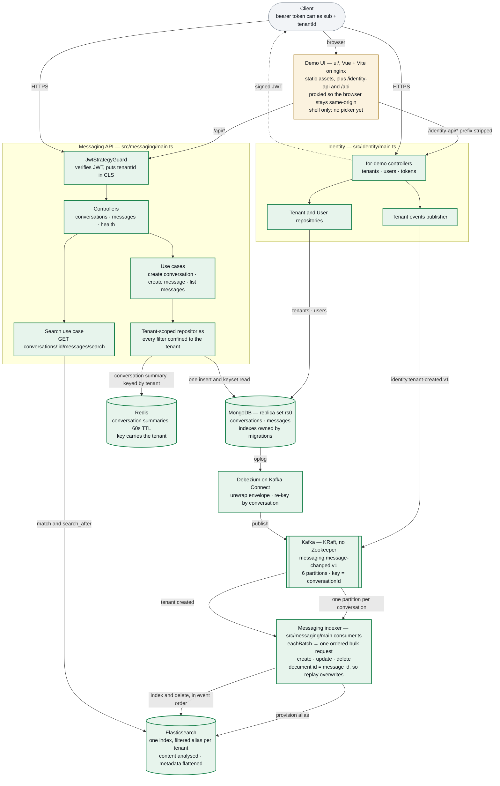

# Architecture

Every component of the service and what state it is in. Kept beside the code so
it can be corrected in the same commit as the thing it describes.

| | Meaning |
|---|---|
| green | Built and verified on a running stack |
| amber | Scaffolded — exists, does no work yet |
| red, dashed | Not built; dashed edges are flows that do not run |

A message is written **once**, to MongoDB. Nothing publishes to Kafka on the
request path — Debezium reads the oplog instead, so there is no moment where the
message is stored but the event is lost.

The topic carries the whole change stream, not just insertions — the name says
`changed` because a create, an edit and a deletion all travel over it. The consumer
takes whole batches off it and turns each event into one Elasticsearch operation, in
the order the events arrived: a create and an edit both write the document whole, a
deletion removes it. Posting a message makes it searchable in about two seconds,
editing it replaces the indexed copy, and deleting it removes it — all verified on
compose, as is searching it: a term posted through the API is findable within a
couple of seconds, scoped to one conversation and one tenant. Nothing in the diagram
is dashed any more: every arrow carries traffic.

The one amber box is the demo UI: its container is verified — both proxied APIs
answer JSON through it — but it drives nothing yet, being one health panel and the
client that later pages will use.

It sits outside both subgraphs deliberately. It is a browser client, not a part of
either service: identity served it at first, and doing so meant the page could load
while every call it made returned `index.html` under a 200, because identity has no
`/identity-api` prefix to strip. The proxy is what makes the built client behave the
way the dev server does.

## What state each component is in

The colours in the diagram above are the answer: green does work in the running
system, amber exists and is proven but nothing calls it, red is not built.

**Milestone status is not here** — it is in [PROGRESS.md](../PROGRESS.md), which is
the only file that claims what is done and names the check that settled it. A table
of phases in a document about components was a second place for that to drift, and
it drifted.

## Known gaps

**Search aliases are created twice over, on purpose.** Identity's
`tenant-created` event provisions a tenant's alias before its first message
arrives, and `ensureAlias` still creates one lazily if the event was never seen.
The second is the recovery path rather than the design: publishing is a dual write
— the only one in the system — and a lost publish degrades to the behaviour that
existed before the event did. What made the lost case dangerous, an alias typo
silently becoming a concrete index, is now refused by
`action.auto_create_index`.

**No endpoint lists conversations.** They can be created and posted into, but not
enumerated — which is also why `lastMessageAt` was dropped rather than built: it
would have been maintained for no reader. `GET /api/v1/conversations` ordered by
recent activity is the natural next endpoint, and the one that would give it a
purpose.

**The topic name is written twice.** `KafkaTopic.MessageChanged` is injected into
the connector config by `scripts/register-debezium.ts`, so the producer cannot
drift from the consumer — but the collection name in
`infra/debezium/message-connector.json` is still a literal that has to match
`MESSAGES_COLLECTION`.

## Decisions

The reasoning behind each of these — and the trade-offs accepted — is in
[PLAN.md](./PLAN.md). The capacity numbers behind the Kafka partitioning choice
are in [back-of-envelope.md](./back-of-envelope.md).
