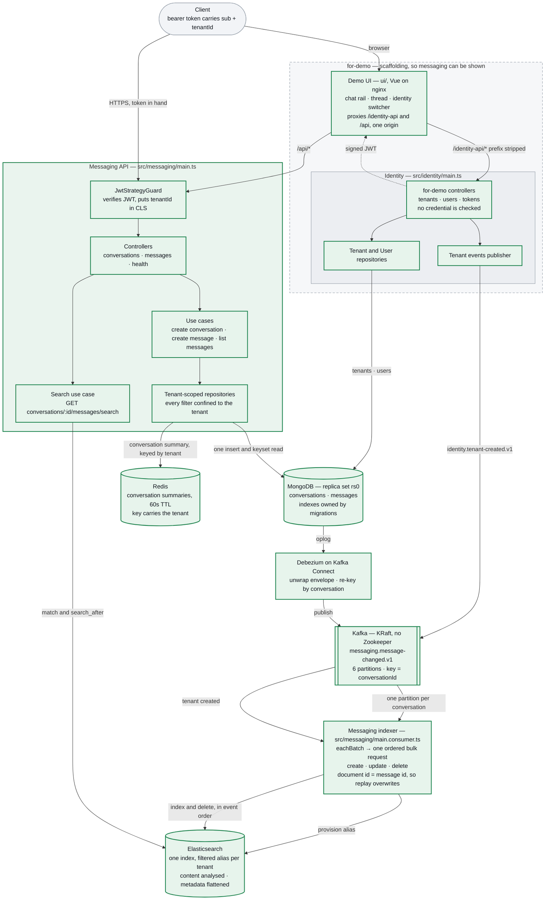

# Architecture

Every component of the service and what state it is in. Kept beside the code so
it can be corrected in the same commit as the thing it describes.

| | Meaning |
|---|---|
| green | Built and verified on a running stack |
| grey, dashed box | **`for-demo`** — scaffolding, so the service can be shown to somebody. It would not ship in this form |

Everything is green: there is nothing here that is built but unproven, and nothing
sketched that does not run. Amber and red were in this legend while that was not
true, and are gone with the things they described.

A message is written **once**, to MongoDB. Nothing publishes to Kafka on the
request path — Debezium reads the oplog instead, so there is no moment where the
message is stored but the event is lost.

The topic carries the whole change stream, not just insertions — the name says
`changed` because a create, an edit and a deletion all travel over it. The consumer
takes whole batches off it and turns each event into one Elasticsearch operation, in
the order the events arrived: a create and an edit both write the document whole, a
deletion removes it. Posting a message makes it searchable in about two seconds,
editing it replaces the indexed copy, and deleting it removes it — all verified on
compose, as is searching it: a term posted through the API is findable within a
couple of seconds, scoped to one conversation and one tenant. Every arrow carries
traffic — the one dashed edge is a response, not an unbuilt flow.

**The grey box is the point of the picture.** Identity and the demo client are in it
because neither is the subject: the brief asks for messaging, and these exist so that
messaging can be driven by a person rather than by curl. Identity hands out a token
to anyone who names a user, without checking a credential — `ForDemoOnlyGuard`
refuses every one of those routes outside a local environment. The client is a Vue
app on nginx, which also proxies both APIs so the browser stays on one origin.

Everything outside that box is the service being assessed, and none of it knows the
box exists. Messaging never calls identity; it verifies a signature and reads the
tenant out of the claim. Take the grey box away and messaging is unchanged — you
would simply have to issue your own tokens.

## What state each component is in

The colours in the diagram above are the answer: green does work in the running
system, amber exists and is proven but nothing calls it, red is not built.

**Milestone status is not here** — it is in [PROGRESS.md](../PROGRESS.md), which is
the only file that claims what is done and names the check that settled it. A table
of phases in a document about components was a second place for that to drift, and
it drifted.

## Known gaps

**Search aliases are created twice over, on purpose.** Identity's
`tenant-created` event provisions a tenant's alias before its first message
arrives, and `ensureAlias` still creates one lazily if the event was never seen.
The second is the recovery path rather than the design: publishing is a dual write
— the only one in the system — and a lost publish degrades to the behaviour that
existed before the event did. What made the lost case dangerous, an alias typo
silently becoming a concrete index, is now refused by
`action.auto_create_index`.

**Conversations are listed by creation, not by activity.** `GET /api/v1/conversations`
returns the caller's own, newest first, behind a multikey index on
`(tenantId, participantIds, createdAt, _id)`. A messenger normally sorts by the newest
message, which needs the `lastMessageAt` dropped in M3.4 because nothing read it —
something reads it now, so it is a real candidate again. It stays out because
maintaining it is an extra write on the hottest path in the product, and that is its
own decision.

**The projection cannot rebuild itself from the log.** The connector runs with
`snapshot.mode: no_data` and Kafka retention is finite, so the topic is not a full
history of the collection. `pnpm es:reindex` rebuilds the index from MongoDB instead,
with `--prune` for documents whose message is gone. It was written after a count
found 392 messages against 200 indexed documents — all of the missing predating a
period when the stack was being torn down and rebuilt, and every message since
present.

**The topic name is written twice.** `KafkaTopic.MessageChanged` is injected into
the connector config by `scripts/register-debezium.ts`, so the producer cannot
drift from the consumer — but the collection name in
`infra/debezium/message-connector.json` is still a literal that has to match
`MESSAGES_COLLECTION`.

## Decisions

The reasoning behind each of these — and the trade-offs accepted — is in
[PLAN.md](./PLAN.md). The capacity numbers behind the Kafka partitioning choice
are in [back-of-envelope.md](./back-of-envelope.md).
