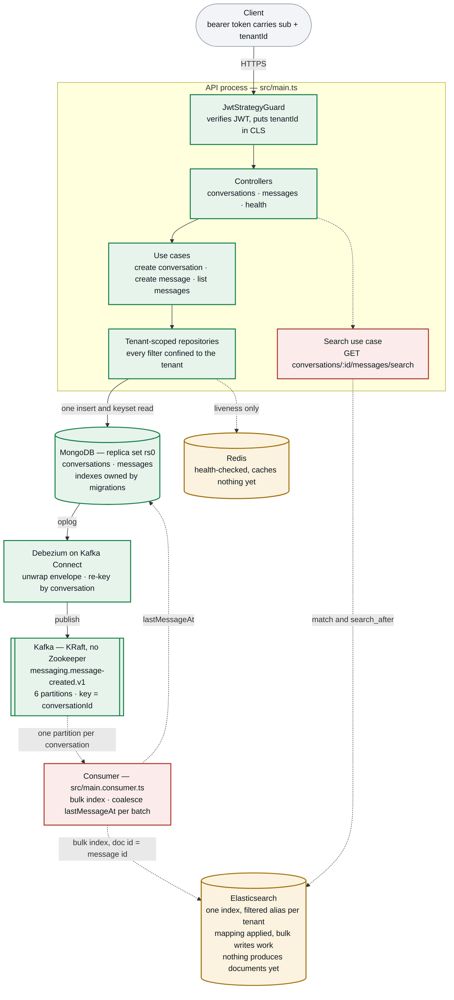

# Architecture

Every component of the service and what state it is in. Kept beside the code so
it can be corrected in the same commit as the thing it describes.

| | Meaning |
|---|---|
| green | Built and verified on a running stack |
| amber | Scaffolded — exists, does no work yet |
| red, dashed | Not built; dashed edges are flows that do not run |

A message is written **once**, to MongoDB. Nothing publishes to Kafka on the
request path — Debezium reads the oplog instead, so there is no moment where the
message is stored but the event is lost.

Elasticsearch is provisioned and can be written to, but the two dashed arrows into
it are the gap: no process consumes the topic, and no endpoint queries the index.

## Where each phase left off

| Phase | What it covers | Status |
|---|---|---|
| M0 | Template ported to MongoDB: tenant-scoped repositories, stateless JWT, CLS, logging, health check, three-mode test harness | done |
| M1 | Conversations and messages — cursor pagination, index migrations, authorisation, three endpoints | done |
| M2 | Kafka in KRaft mode, Debezium connector, the SMT chain, topic keyed by conversation | done |
| M3 | The Elasticsearch index schema — mapping, `dynamic: strict`, the apply step | done |
| M3.1 | Bulk writes into the index, behind per-tenant aliases | done |
| M3.2 | The consumer process that fills the index from the Kafka topic | not started |
| M3.3 | `search_after` queries and the search endpoint | not started |
| M3.4 | `lastMessageAt` on the conversation | not started |
| M4 | README for a cold reader, ADRs, domain glossary | not started |

M3 is split so each part can be reviewed on its own: the schema alone first, then
one thin slice at a time, each ending with something demonstrable. The reasoning
is in [PLAN.md](./PLAN.md#search--m3-through-m34).

Amber marks something narrower than work in progress: a part that exists and is
proven, but that nothing in the running system calls yet.

## Known gaps

**Elasticsearch has no producer and no reader.** The mapping is applied and
`MessageSearchIndex.indexMany` is covered against a real cluster, but the only
thing that calls it is its own spec. The consumer arrives in M3.2, the search
endpoint in M3.3.

**Search aliases are created on the write path.** `ensureAlias` creates a tenant's
filtered alias the first time that tenant's messages are indexed, cached in a
per-process `Set`. It belongs in tenant provisioning instead — there is no tenant
lifecycle in this codebase yet, so every tenant-shaped resource is created lazily.
Moving it collapses `ensureAlias` into a pure string and removes the cache
entirely. The failure mode that makes this worth moving, and the cheaper fix that
neutralises it either way, are in [PLAN.md §10](./PLAN.md#10-deferred--tenant-provisioning).

**Redis caches nothing.** It is configured, health-checked and proven reachable,
but no use case caches anything through it. Caching is optional in the brief.

**`pnpm start:consumer` is currently broken.** The script runs
`node dist/main.consumer` and that file does not exist yet — it arrives with M3.2.
Nothing else references it, so the failure is confined to anyone who runs that
one command.

**The topic name is written twice.** `KafkaTopic.MessageCreated` is injected into
the connector config by `scripts/register-debezium.ts`, so the producer cannot
drift from the consumer — but the collection name in
`infra/debezium/message-connector.json` is still a literal that has to match
`MESSAGES_COLLECTION`.

## Decisions

The reasoning behind each of these — and the trade-offs accepted — is in
[PLAN.md](./PLAN.md). The capacity numbers behind the Kafka partitioning choice
are in [back-of-envelope.md](./back-of-envelope.md).
