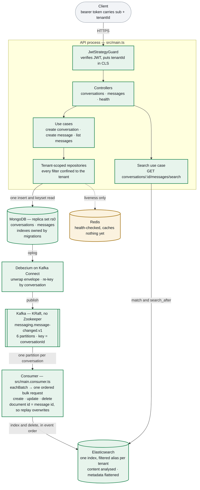

# Architecture

Every component of the service and what state it is in. Kept beside the code so
it can be corrected in the same commit as the thing it describes.

| | Meaning |
|---|---|
| green | Built and verified on a running stack |
| amber | Scaffolded — exists, does no work yet |
| red, dashed | Not built; dashed edges are flows that do not run |

A message is written **once**, to MongoDB. Nothing publishes to Kafka on the
request path — Debezium reads the oplog instead, so there is no moment where the
message is stored but the event is lost.

The topic carries the whole change stream, not just insertions — the name says
`changed` because a create, an edit and a deletion all travel over it. The consumer
takes whole batches off it and turns each event into one Elasticsearch operation, in
the order the events arrived: a create and an edit both write the document whole, a
deletion removes it. Posting a message makes it searchable in about two seconds,
editing it replaces the indexed copy, and deleting it removes it — all verified on
compose, as is searching it: a term posted through the API is findable within a
couple of seconds, scoped to one conversation and one tenant. The single dashed
every arrow now carries traffic.

## Where each phase left off

| Phase | What it covers | Status |
|---|---|---|
| M0 | Template ported to MongoDB: tenant-scoped repositories, stateless JWT, CLS, logging, health check, three-mode test harness | done |
| M1 | Conversations and messages — cursor pagination, index migrations, authorisation, three endpoints | done |
| M2 | Kafka in KRaft mode, Debezium connector, the SMT chain, topic keyed by conversation | done |
| M3 | The Elasticsearch index schema — mapping, `dynamic: strict`, the apply step | done |
| M3.1 | Bulk writes into the index, behind per-tenant aliases | done |
| M3.2 | The consumer process that fills the index from the Kafka topic | done |
| M3.3 | `search_after` queries and the search endpoint | done |
| M3.4 | `lastMessageAt` on the conversation | dropped — nothing reads it, see [PLAN.md](./PLAN.md) |
| M4 | README for a cold reader, seven ADRs, domain glossary | done |

M3 is split so each part can be reviewed on its own: the schema alone first, then
one thin slice at a time, each ending with something demonstrable. The reasoning
is in [PLAN.md](./PLAN.md#search--m3-through-m34).

Amber marks something narrower than work in progress: a part that exists and is
proven, but that nothing in the running system calls yet.

## Known gaps

**Search aliases are created on the write path.** `ensureAlias` creates a tenant's
filtered alias the first time that tenant's messages are indexed, cached in a
per-process `Set`. It belongs in tenant provisioning instead — there is no tenant
lifecycle in this codebase yet, so every tenant-shaped resource is created lazily.
Moving it collapses `ensureAlias` into a pure string and removes the cache
entirely. The failure mode that makes this worth moving, and the cheaper fix that
neutralises it either way, are in [PLAN.md §10](./PLAN.md#10-deferred--tenant-provisioning).

**No endpoint lists conversations.** They can be created and posted into, but not
enumerated — which is also why `lastMessageAt` was dropped rather than built: it
would have been maintained for no reader. `GET /api/v1/conversations` ordered by
recent activity is the natural next endpoint, and the one that would give it a
purpose.

**Redis caches nothing.** It is configured, health-checked and proven reachable,
but no use case caches anything through it. Caching is optional in the brief.

**The topic name is written twice.** `KafkaTopic.MessageChanged` is injected into
the connector config by `scripts/register-debezium.ts`, so the producer cannot
drift from the consumer — but the collection name in
`infra/debezium/message-connector.json` is still a literal that has to match
`MESSAGES_COLLECTION`.

## Decisions

The reasoning behind each of these — and the trade-offs accepted — is in
[PLAN.md](./PLAN.md). The capacity numbers behind the Kafka partitioning choice
are in [back-of-envelope.md](./back-of-envelope.md).
