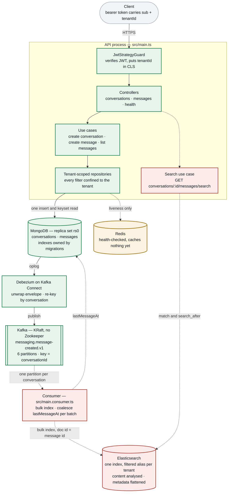

# Architecture

Every component of the service and what state it is in. Kept beside the code so
it can be corrected in the same commit as the thing it describes.

| | Meaning |
|---|---|
| green | Built and verified on a running stack |
| amber | Scaffolded — exists, does no work yet |
| red, dashed | Not built; dashed edges are flows that do not run |

A message is written **once**, to MongoDB. Nothing publishes to Kafka on the
request path — Debezium reads the oplog instead, so there is no moment where the
message is stored but the event is lost. Everything below the Kafka topic, and
the search branch, is still a plan.

## Where each phase left off

| Phase | What it covers | Status |
|---|---|---|
| M0 | Template ported to MongoDB: tenant-scoped repositories, stateless JWT, CLS, logging, health check, three-mode test harness | done |
| M1 | Conversations and messages — cursor pagination, index migrations, authorisation, three endpoints | done |
| M2 | Kafka in KRaft mode, Debezium connector, the SMT chain, topic keyed by conversation | done |
| M3 | The Elasticsearch index schema — mapping, `dynamic: strict`, the apply step | not started |
| M3.1 | Bulk writes into the index, behind per-tenant aliases | not started |
| M3.2 | The consumer process that fills the index from the Kafka topic | not started |
| M3.3 | `search_after` queries and the search endpoint | not started |
| M3.4 | `lastMessageAt` on the conversation | not started |
| M4 | README for a cold reader, ADRs, domain glossary | not started |

M3 is split so each part can be reviewed on its own: the schema alone first, then
one thin slice at a time, each ending with something demonstrable. The reasoning
is in [PLAN.md](./PLAN.md#search--m3-through-m34).

Nothing is mid-flight: M2 closed and M3 has not opened, so no component is
genuinely in progress. Amber marks something narrower — a part that exists but
does no work yet.

## Known gaps

**Redis is the only amber component.** It is configured, health-checked and
proven reachable, but no use case caches anything through it. Caching is optional
in the brief.

**`pnpm start:consumer` is currently broken.** The script runs
`node dist/main.consumer` and that file does not exist yet — it arrives with M3.2.
Nothing else references it, so the failure is confined to anyone who runs that
one command.

**The topic name is written twice.** `KafkaTopic.MessageCreated` is injected into
the connector config by `scripts/register-debezium.ts`, so the producer cannot
drift from the consumer — but the collection name in
`infra/debezium/message-connector.json` is still a literal that has to match
`MESSAGES_COLLECTION`.

## Decisions

The reasoning behind each of these — and the trade-offs accepted — is in
[PLAN.md](./PLAN.md). The capacity numbers behind the Kafka partitioning choice
are in [back-of-envelope.md](./back-of-envelope.md).
